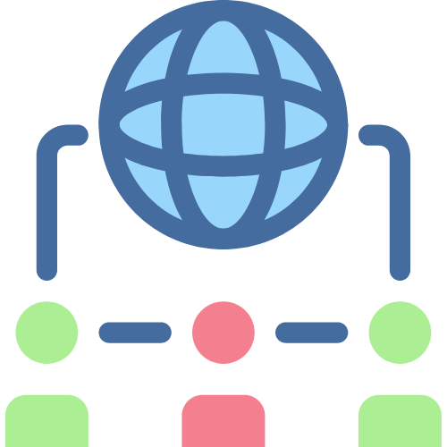

<!-- PROJECT LOGO -->
<a href="LICENSE" target="_blank">
    
</a>
<br />
<div align="center">
  <a href="https://github.com/RaulMaya/Social-Network-API">
    
  </a>

  <h2 align="center">Social Network API</h2>
  <h4 align="center">Express.JS - MongoDB Backend Application</h4>

<br/>
<p align="center">
    <a href="https://expressjs.com/en/5x/api.html" target="_blank">
        
    </a>
    <a href="https://www.mongodb.com/docs/" target="_blank">
        
    </a>
    <a href="https://nodejs.org/en/docs/" target="_blank">
        
    </a>
    <a href="https://docs.insomnia.rest/" target="_blank">
        
    </a>
</p>
<br/>

<p align="center">
Build an API for a social network web application where users can share their thoughts, react to friends’ thoughts, and create a friend list. You’ll use Express.js for routing, a MongoDB database, and the Mongoose ODM.
    <br />
    <br />
    <a href="https://github.com/RaulMaya/Social-Network-API">Repository</a>    
    ·
    <a href="https://www.youtube.com/watch?v=Zyc3FdvM99g">Video</a>
    ·
    <a href="https://www.linkedin.com/in/raul-maya/">My LinkedIn</a>

  </p>
</div>

### Content Table

- [About](#about)
- [Usage](#usage)
- [Installation](#installation)
- [Video](#video)
- [License](#license)
- [Contact](#contact)

<br>

### About

<p>
backend application using Mongoose, a MongoDB object modeling tool, to interact with a MongoDB database. The application defines several routes and functions for managing users and thoughts, including getting all users, getting a specific user by ID, creating a new user, updating an existing user, deleting a user, adding a friend to a user's friend list, getting all thoughts, getting a specific thought by ID, creating a new thought, updating an existing thought, and deleting a thought.</p>

<p>The functions use the Mongoose library to perform database operations, such as querying the database, creating new documents, updating existing documents, and deleting documents. The functions also handle errors by sending an appropriate HTTP response status code and error message in case an error occurs.</p>

<br>

### Usage

<p>The given code defines several CRUD functions for two models, User and Thought. These functions allow to retrieve, create, update, and delete records from these models in a MongoDB database. There are also functions to add and remove friends of a user, and add a thought to a user's list of thoughts. The code exports these functions so that they can be used in other parts of the application.</p>

<br>

### Installation

```
git@github.com:RaulMaya/Social-Network-API.git
npm i
npm start
open Insomnia and test end points
```

<br>

### Video

<a href="https://www.youtube.com/watch?v=Zyc3FdvM99g">

</a>
 
<br>

### License

> You can check out the full license [here](https://github.com/RaulMaya/Social-Network-API/blob/master/LICENSE)
> This project is licensed under the terms of the **MIT** license.

<br>

### Contact

- Name: Raul Maya Salazar
- Phone: +52 833 159 7006
- E-mail: raulmayas20@gmail.com
- GitHub: https://github.com/RaulMaya
- LinkedIn: https://www.linkedin.com/in/raul-maya/

<p align="right">(<a href="#top">back to top</a>)</p>
